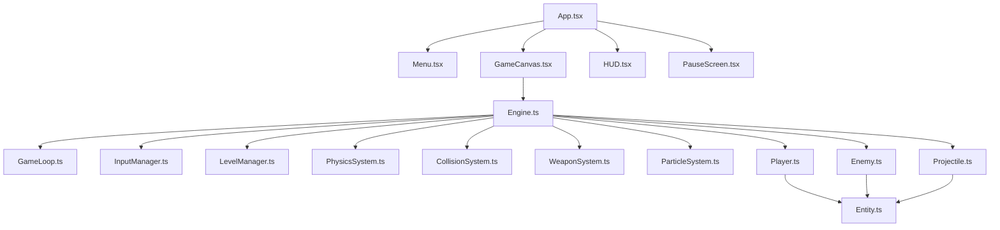
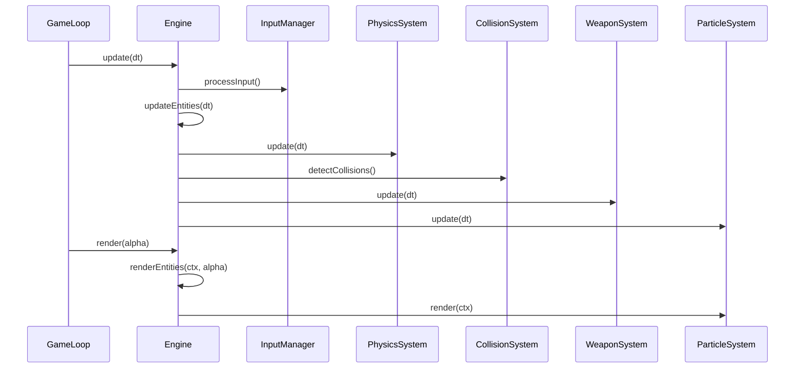

# Design Document

## Overview

The Armor Mayhem Clone is architected as a component-based game engine built on React and TypeScript, using HTML5 Canvas for rendering. The architecture follows an Entity-Component-System (ECS) inspired pattern where entities are managed by a central Engine, and specialized systems handle physics, collisions, weapons, and particles. The game uses a fixed-timestep game loop for deterministic updates and interpolated rendering for smooth visuals.

### Technology Stack
- **React 18+** with TypeScript for UI components and state management
- **Vite** for fast development and optimized production builds
- **HTML5 Canvas API** for 2D rendering
- **Web Audio API** for sound effects
- **localStorage** for persistence

### Architecture Principles
- Separation of concerns: game logic, rendering, and UI are decoupled
- Object pooling for performance-critical entities (projectiles, particles)
- Fixed timestep updates with variable framerate rendering
- Data-driven design for levels and weapon configurations

## Architecture

### High-Level Component Diagram




### System Flow



## Components and Interfaces

### Core Components

#### Engine.ts
The central registry and coordinator for all game systems and entities.

**Responsibilities:**
- Maintain entity registry with unique IDs
- Coordinate system updates in correct order
- Manage entity lifecycle (spawn/despawn)
- Provide entity lookup and query capabilities
- Manage game state (playing, paused, game over)

**Key Methods:**
```typescript
class Engine {
  private entities: Map<EntityID, Entity>
  private systems: System[]
  private nextEntityId: number
  
  spawn(entity: Entity): EntityID
  despawn(id: EntityID): void
  getEntity(id: EntityID): Entity | undefined
  queryEntities(predicate: (e: Entity) => boolean): Entity[]
  update(dt: number): void
  render(ctx: CanvasRenderingContext2D, alpha: number): void
  start(): void
  stop(): void
}
```

#### GameLoop.ts
Implements fixed-timestep game loop with interpolated rendering.

**Responsibilities:**
- Maintain consistent 60Hz update rate
- Accumulate frame time and call updates in fixed steps
- Calculate interpolation alpha for smooth rendering
- Handle requestAnimationFrame lifecycle

**Key Properties:**
- Fixed timestep: 1/60 seconds (16.67ms)
- Accumulator pattern to handle variable frame times
- Alpha interpolation value for render smoothing


#### InputManager.ts
Centralized input handling for keyboard and mouse.

**Responsibilities:**
- Track keyboard key states (pressed/released)
- Track mouse position relative to canvas
- Track mouse button states
- Provide query interface for input state
- Handle canvas coordinate transformation

**Key Methods:**
```typescript
class InputManager {
  private keys: Map<string, boolean>
  private mousePos: Vec2
  private mouseButtons: Map<number, boolean>
  
  isKeyDown(key: string): boolean
  getMousePosition(): Vec2
  isMouseButtonDown(button: number): boolean
  update(canvas: HTMLCanvasElement): void
}
```

**Input Mappings:**
- W/A/S/D: Movement (up/left/down/right)
- Space: Jump
- F: Weapon swap
- Escape: Pause
- Mouse position: Aim direction
- Left mouse button: Fire weapon

### Entity System

#### Entity.ts (Base Class)
Abstract base class for all game objects.

**Properties:**
```typescript
abstract class Entity {
  id: EntityID
  position: Vec2
  velocity: Vec2
  size: Vec2
  active: boolean
  tags: Set<string>
  
  abstract update(dt: number): void
  abstract render(ctx: CanvasRenderingContext2D): void
  getBounds(): Rect
  hasTag(tag: string): boolean
}
```

**Design Rationale:**
- Tags enable flexible entity queries (e.g., "enemy", "projectile", "player")
- Bounding box calculation centralized for collision detection
- Active flag allows soft deletion (pooling)

#### Player.ts
Player-controlled character entity.

**Properties:**
```typescript
class Player extends Entity {
  health: number
  maxHealth: number
  moveSpeed: number
  jumpForce: number
  currentWeapon: number
  weapons: WeaponDef[]
  grounded: boolean
  aimAngle: number
  
  update(dt: number): void
  render(ctx: CanvasRenderingContext2D): void
  takeDamage(amount: number): void
  shoot(): void
  swapWeapon(): void
}
```

**Behavior:**
- Smooth acceleration-based movement (not instant velocity)
- Variable jump height based on key hold duration
- Aim angle calculated from mouse position
- Knockback applied when taking damage
- Weapon sprite rotates to aim angle


#### Enemy.ts
AI-controlled hostile entity.

**Properties:**
```typescript
class Enemy extends Entity {
  health: number
  aiState: 'idle' | 'patrol' | 'chase' | 'attack'
  sightRadius: number
  attackRange: number
  patrolPoints: Vec2[]
  currentPatrolIndex: number
  attackCooldown: number
  
  update(dt: number): void
  render(ctx: CanvasRenderingContext2D): void
  takeDamage(amount: number): void
  updateAI(dt: number, player: Player): void
}
```

**AI State Machine:**
1. **Idle**: Stand still, check for player
2. **Patrol**: Move between waypoints
3. **Chase**: Move toward player when detected
4. **Attack**: Fire weapon or melee when in range

**Detection Logic:**
- Check distance to player each frame
- If within sightRadius, transition to chase
- Line-of-sight check optional (can shoot through walls initially)

#### Projectile.ts
Bullet or pellet fired from weapons.

**Properties:**
```typescript
class Projectile extends Entity {
  owner: EntityID
  damage: number
  lifetime: number
  speed: number
  
  update(dt: number): void
  render(ctx: CanvasRenderingContext2D): void
  onHit(target: Entity): void
}
```

**Behavior:**
- Moves in straight line at constant speed
- Despawns after lifetime expires
- Despawns on collision with non-owner entity
- Owner ID prevents self-damage

### Game Systems

#### PhysicsSystem.ts
Handles gravity, velocity integration, and platform collisions.

**Responsibilities:**
- Apply gravity to entities with physics enabled
- Integrate velocity into position
- Detect and resolve platform collisions
- Apply ground friction when grounded
- Handle slope collisions (optional)

**Algorithm:**
```
For each entity with physics:
  1. Apply gravity: velocity.y += gravity * dt
  2. Apply friction if grounded: velocity.x *= friction
  3. Update position: position += velocity * dt
  4. Check platform collisions
  5. Resolve overlaps and adjust velocity
```

**Platform Collision:**
- AABB sweep test for continuous collision
- Resolve by moving entity to platform surface
- Set grounded flag when on platform
- Support one-way platforms (can jump through from below)

